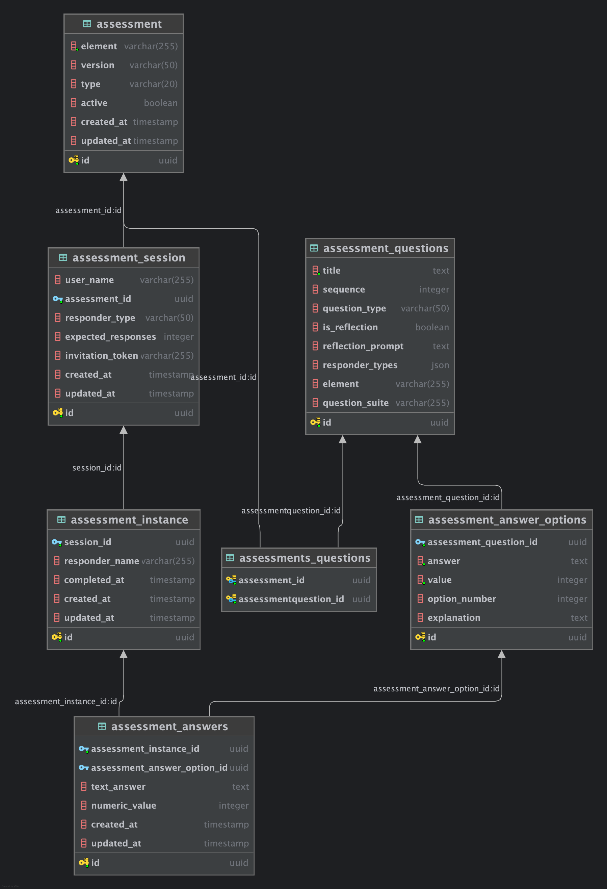

# Solution - Hassam Waheed

## Task Completed
Backend/Full-Stack

## Time Spent
180 minutes

## Approach
My approach was straightforward: I prioritized the project documentation and instructions before diving into the code. Having previous experience in this specific industry, I was already familiar with the architectural patterns and business logic required for educational assessments.

I began by auditing the Database schema via the `.sql` seed file and cross-referencing it with the Doctrine models. After mapping the entity relationships, I reviewed the scoring logic in the service layer, identifying potential edge cases.

For the implementation phase, I focused on high-integrity data entry. I built the **POST** and **PUT** endpoints with a "Service-First" mindset, ensuring that all validation, logging, and error-handling logic is encapsulated within the Domain layer for maximum reusability and observability.

---

## PHASE 1: Entity Relationship Diagram


The assessment system is built on a decoupled architecture that separates the reusable assessment templates from the individual user sessions and response data.

1. **assessment (The Template)**
    - **Description**: The core "blueprint" for an assessment (e.g., "Element 1.1").
    - **Keys**: `id` is the Primary Key.
    - **Cardinality**: Many-to-Many (N:M) with `assessment_questions` via the pivot table.

2. **assessment_questions (The Question Bank)**
    - **Description**: Defines the question content and response type (Likert or Reflection).
    - **Keys**: `id` is the Primary Key.
    - **Cardinality**: Linked via pivot table, allowing questions to be reused across different assessment templates.

3. **assessment_answer_options (Multiple Choice Definitions)**
    - **Description**: Stores the predefined 1-5 scale for Likert questions.
    - **Keys**: `id` (Primary Key) and `assessment_question_id` (Foreign Key).
    - **Cardinality**: Many-to-One (N:1) with `assessment_questions`. `option_number` dictates the display sequence.

4. **assessment_session (The User's Journey)**
    - **Description**: Tracks a specific user's engagement with an assessment blueprint.
    - **Keys**: `id` (Primary Key) and `assessment_id` (Foreign Key).
    - **Cardinality**: Many-to-One (N:1) with `assessment`.

5. **assessment_instance (The Specific Attempt)**
    - **Description**: Tracks a specific "run" within a session, including completion timestamps.
    - **Keys**: `id` (Primary Key) and `session_id` (Foreign Key).
    - **Relationship**: Many-to-One (N:1) with `assessment_session`.

6. **assessment_answers (The Captured Data)**
    - **Description**: The actual raw data. Stores a reference to a preset option (Likert) or raw text (Reflection).
    - **Keys**: `id` (Primary Key), `assessment_instance_id` (Foreign Key), and `assessment_answer_option_id` (Foreign Key).
    - **Cardinality**: Many-to-One (N:1) with `assessment_instance`.

---

## Phase 2: Review Results Calculation

### Scoring Algorithm Analysis
I verified the `AssessmentService::getProgressAndScore()` logic to confirm the **53.85%** result for instance `d1111111...`.

**The Logic:**
The system utilizes a normalization formula: `(total_score - answered_questions) / (max_score - answered_questions) * 100`.

### Review & Refinements
I identified several architectural improvements to make this service production-ready:

#### 1. Optimization: N+1 Query Problem
The current implementation calls `findAssessmentAnswerOptionsByQuestion()` inside a `foreach` loop. This triggers a separate database query for every question in the assessment.
* **Observation**: Scaling to larger assessments would cause significant latency.
* **Recommendation**: I would refactor the repository to eager-load all possible answer options in a single query indexed by question ID to keep DB overhead constant.

#### 2. Hardened Error Handling
I implemented the following defensive measures:
* **Null Safety**: Added guards for `Session` and `Assessment` objects to prevent 500 errors on orphaned instance data.
* **Division-by-Zero Guards**: Hardened the logic for `completion_percentage` and `scorePercentage`. If a template has zero questions, the service returns 0 rather than crashing the API.
* **Rounding Consistency**: Standardized all percentages to 2 decimal places to ensure a clean API contract.

---

## Phase 3: Implement Answer Submission

### Architectural Implementation
I implemented the `POST /api/assessment/answers` endpoint, encapsulating the logic within the `AssessmentService` to maintain "thin" controllers.

**Validation Logic:**
* **Relational Integrity**: The service verifies the `question_id` actually belongs to the assessment template linked to the user's current session.
* **Likert Constraints**: Validates that the `answer_option_id` is a valid child of the target question to prevent data "cross-pollination".
* **Persistence & Logging**: Integrated `EntityManagerInterface` for safe persistence and `LoggerInterface` to provide production observability for both successes and failures.

### Data Persistence & Idempotency
During testing, I noted that multiple submissions for one question increase row count. The current scoring logic handles this by only processing the latest timestamp per `question_id`.

### Verification of PUT (Update) Functionality
I implemented a dedicated **PUT** endpoint to handle state-management for existing answers.

**Test Case: Reflection Update**
1. **Initial Submission**: Created a reflection via POST.
2. **Update Execution**: Targeted the specific Answer ID via the PUT endpoint to modify the `text_answer`.
3. **Observation**: Confirmed the text updated successfully while maintaining the original record ID, verifying the patch-style update in the service.

## Implementation Details
Build two apis, one for posting the answer and other one is for updating an existing answer.

Following the best coding practices, created a standalone function within the controller using the magic method invoke. Implemented Validations, error handling and logging strategy.

Implemented the business logic in Service layer, so that we can reuse it later on if necessary. Kept the controller clean.

Created different branch for each phase solution. Made the PR. Approved the PR and merged respectively.

## Tools & Libraries Used
**Libraries:** 
- use Doctrine\ORM\EntityManagerInterface;
- use Psr\Log\LoggerInterface;
- use \DateTimeInterface;

**AI Tools:** 
- Google Gemini

**IDE:** 
- PHPSTORM

### Testing
```bash
# Submit missing Q3 Likert response (Score updates: 53.85% -> 75.00%)
curl -X POST http://localhost:8002/api/assessment/answers \
  -H "Content-Type: application/json" \
  -d '{
    "instance_id": "d1111111-1111-1111-1111-111111111111",
    "question_id": "a3333333-3333-3333-3333-333333333333",
    "answer_option_id": "b3333333-3333-3333-3333-333333333333"
  }'

# Submit Reflection Answer
curl -X POST http://localhost:8002/api/assessment/answers \
  -H "Content-Type: application/json" \
  -d '{
    "instance_id": "d1111111-1111-1111-1111-111111111111",
    "question_id": "a4444444-4444-4444-4444-444444444444",
    "text_answer": "This is my testing answer."
  }'

curl -X PUT http://localhost:8002/api/assessment/answers/{id}\
  -H "Content-Type: application/json" \
  -d '{
    "text_answer": "UPDATE: Hello World, this is my testing answer updated."
  }'
  
  docker compose logs -f backend (To see the logs)
  I use docker compose, as I have updated version of Docker Desktop.
  You can use docker-compose based on your version.
```

## Challenges & Solutions
As I mentioned earlier I have worked with this architecture design before and also with this business logic of questions and answers before in the past. It wasn't too hard for me to understand the structure of the project or to understand the business logic. 

The project that I have previously worked on, had this business logic as well where employees would answer the questions and employers could see their progress as well. It was created in Livewire (TALL Stack Development). But yeah, I fixed bugs in them and created a lot more features within that project.

In terms of project architecture, I always work with Docker. We have kind of same project structure where I work currently, it's just we have a few more python apis as well.

## Trade-offs & Future Improvements
- Removing the N + 1 queries from the system.
- Implement try catch.
- Implement logging strategy.
- Implement indexing in database columns. 
- Implement combined indexing in database table columns that are widely used for searching.
- Implement deleted_at column in tables for SoftDeletes.
- Implement OpenSearch for Audit trails logs.